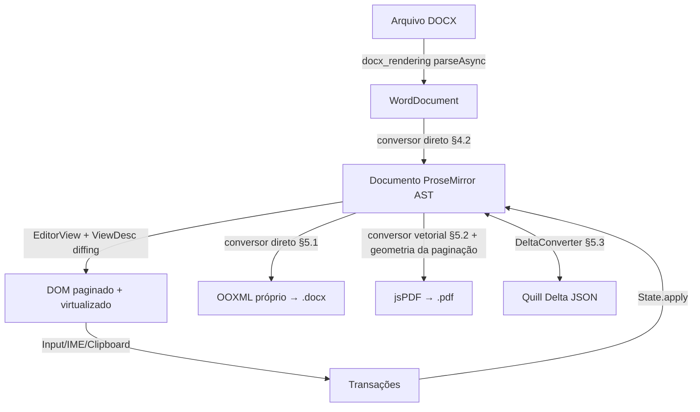

# PLANO TÉCNICO COMPLETO: EDITOR ESTILO TIPTAP.DEV EM DART PURO

Plano de engenharia para construir um editor interativo no navegador equivalente ao [tiptap.dev](https://tiptap.dev/) (cópia visual salva em `referencias/tiptap.dev/tiptap.dev/index.html`), com os seguintes requisitos **não-funcionais como cidadãos de primeira classe**:

| # | Requisito | Meta mensurável (documento de referência: os DOCX grandes em `resources/`) |
|---|-----------|------------------------------------------------------------------------------|
| R1 | Abrir DOCX grande de forma eficiente | Primeira página visível < 1,5 s; documento de 200+ páginas navegável sem travar a UI (nenhuma tarefa > 50 ms no main thread após o primeiro paint) |
| R2 | Exportar DOCX | Documento de 200 páginas exportado < 3 s, fiel (estilos, tabelas, imagens, headers/footers) |
| R3 | Aplicar deltas grandes vindos do Quill | Delta com 50k+ ops convertido e aplicado < 1 s, em uma única transação |
| R4 | Exportar PDF rápido | PDF **vetorial** (texto selecionável/pesquisável) de 200 páginas < 5 s, sem rasterização |
| R5 | Edição fluida | Digitação em documento de 200 páginas com latência de tecla < 16 ms |

Tudo em **Dart puro** (runtime só com `package:web ^1.1.1`), compatível com compilação JS e Wasm.

---

## 1. INVENTÁRIO DE ATIVOS REUTILIZÁVEIS (o que já existe e onde)

Levantamento feito em jul/2026 sobre `C:\MyDartProjects`:

### 1.1. Neste repositório (`docx_rendering`)
- **Porte ProseMirror** (`lib/src/prosemirror/`): `model`, `transform`, `state`, `commands`, `history`, `keymap`, `inputrules`, `test_builder` e uma **view funcional inicial** em `lib/src/prosemirror/view/`. A view já monta `EditorView`, `ViewDesc`, `MutationObserver`, seleção DOM↔state, decorações, clipboard e handlers de input. `dart analyze` e `dart analyze lib/src/prosemirror/view/` estão limpos.
- **Porte Tiptap** (`lib/src/tiptap/`): core inicial com `TiptapEditor`, `ExtensionManager`, `CommandManager` encadeável mínimo, extensões `Document/Text/Paragraph/Bold/Italic`, plugins padrão de `history`/`keymap` e demo web digitável.
- **Renderizador DOCX→DOM** (`lib/src/docx_rendering/`): porte do docx-preview, com `renderAsync`. Carrega tudo em memória e renderiza de uma vez — sem lazy/streaming (ver §4.1).
- **Paginação pós-render** (`lib/src/docx_rendering/renderer/pagination.dart`, 483 linhas): arquitetura Measure→Plan→Build (evita reflow), clona headers/footers, divide tabelas linha a linha e já divide parágrafos longos por busca binária com `Range.getBoundingClientRect`.
- **Harness Puppeteer** (`test/docx_rendering/render_harness.dart`): compila a demo, serve, faz upload de cada DOCX de `resources/`, salva PNG+HTML — base pronta para benchmarks automatizados.
- **Referências-fonte** em `referencias/`: todos os repositórios ProseMirror oficiais (inclusive `prosemirror-history`, `-commands`, `-keymap`, `-dropcursor`), o monorepo `tiptap-main`, e **quatro extensões de paginação do Tiptap** (`tiptap-pages`, `tiptap-extension-pagination`, `tiptap-pagination`, `tiptap-pagination-breaks`).

### 1.2. Projetos vizinhos
- **`docx_dart`** — porte maduro do python-docx (v1.2.0, 13 suítes de teste). **Escreve DOCX de verdade**: `addHeading`, `addParagraph`, `addTable`, `addPicture`, seções, headers/footers, merge de células, campos (TOC/PAGE). **Funciona na web** (ZIP próprio in-memory em `lib/src/internal/archive/`, opera por bytes via `lib/src/platform/file_access_stub.dart`). → pipeline de exportação DOCX.
- **`dart_quill`** — Delta **completo** em `lib/src/dependencies/dart_quill_delta/core/`: `delta.dart` com `compose`, `transform`, `diff`, `invert`; `delta_iterator.dart` (`peekLength`, `next(length)`); `operation.dart`. → base canônica do pipeline Quill (não reimplementar).
- **`jsPDF`** — porte Dart puro completo do jsPDF (17 suítes): texto + `split_text_to_size.dart` (word wrap), **embedding/subset TTF** (`lib/src/libs/ttffont.dart` parseia head/cmap/hhea/hmtx/glyf...), imagens (PNG/JPEG/BMP), vetorial (`modules/context2d.dart`, `matrix.dart`), Flate próprio, saída `blob`/`save()` na web. → pipeline PDF.
- **`canvas-editor-port`** / **`canvas_text_editor`** — editores em canvas, **fora do escopo** (este projeto NÃO é editor em canvas — ver §2). Só interessam como referência de código pontual: `canvas-editor-port/lib/src/document/` tem `docx/writer.dart` e `pdf/pdf_writer.dart` (pipelines de arquivo, independentes de canvas) caso `docx_dart`/`jsPDF` apresentem lacunas.
- **`pdf.js` / `pdfium_dart`** — portes Dart de *leitura* de PDF. Só relevantes se quisermos preview do PDF gerado; fora do caminho crítico.
- **Evitar na web:** `dart_graphics` (FFI/.dll, só VM); `pdfbox_dart` e `itext` (puro Dart, mas orientados a VM/assinatura — `itext/lib/src/layout` fica como alternativa de última instância ao jsPDF).

---

## 2. ARQUITETURA GERAL

**Decisão fundamental: o editor é HTML DOM + `contenteditable`, exatamente como o tiptap.dev.** A superfície de edição é a `EditorView` do ProseMirror renderizando nós DOM reais (parágrafos, tabelas, imagens como elementos HTML), com o browser cuidando de layout de texto, seleção nativa, IME e acessibilidade. **Não há renderização em canvas em nenhuma camada do editor** — os projetos de editor-em-canvas do workspace estão fora do escopo. O único uso de "desenho" é na exportação PDF (§5.2), que emite operadores vetoriais de PDF (não é canvas do browser).

**Decisão de arquitetura (mudança em relação ao plano anterior):** os conversores de exportação (DOCX, PDF, Delta) fazem travessia **direta do AST ProseMirror**, sem passar por HTML intermediário via `DOMSerializer`. Motivos: (a) HTML perde informação (estilos de seção, numeração, larguras de tabela em twips); (b) serializar para DOM e re-parsear é O(n) extra com alocação pesada; (c) a travessia do AST é pura (roda fora do DOM, testável na VM). O `DOMSerializer` continua existindo apenas para o clipboard e para `getHTML()`.

---

## 3. LACUNA CRÍTICA #1: A VIEW REAL DO PROSEMIRROR

A view deixou de ser scaffold e agora é uma implementação funcional inicial. **Ela continua sendo o item que define R1 e R5**: no ProseMirror original, a classe `ViewDesc` mantém uma árvore paralela DOM↔documento e, a cada transação, redesenha **apenas os nós alterados** (diffing estrutural). O próximo trabalho aqui é endurecer a fidelidade do `domchange`/IME/clipboard e medir re-render localizado em documentos grandes.

### 3.1. Tarefas (portar de `referencias/prosemirror-view/src/`)
- [x] `viewdesc.dart` real: hierarquia `ViewDesc`/`NodeViewDesc`/`TextViewDesc`/`MarkViewDesc`, algoritmo `updateChildren` (reuso de nós DOM), mapeamento DOM↔posição.
- [x] `domobserver.dart` inicial real: `MutationObserver` + reconciliação de edições nativas do browser por região suja.
- [x] `input.dart` inicial real: keydown → keymap, composição IME (`compositionstart/end`), beforeinput e props de plugin.
- [x] `clipboard.dart`: copy/cut serializa via `DOMSerializer`; paste via `parseSlice`.
- [x] Seleção: sincronização bidirecional `Selection` DOM ↔ `TextSelection`/`NodeSelection`.
- [x] `decoration.dart`: `Decoration.widget/inline/node` + `DecorationSet` (necessário para cursor de drop, realce de busca e paginação por decorações).
- [x] Portar `prosemirror-dropcursor` (plugin visual via `PluginSpec.view`, `DropCursorView` e extensão Tiptap `DropcursorExtension`).
- [ ] Endurecer `domchange.dart` para paridade completa com `prosemirror-view/src/domchange.ts`, incluindo casos de composição, joins/backspace e restauração precisa de seleção.
- [ ] Adicionar teste de `MutationObserver` provando re-render localizado por parágrafo.

**Aceite parcial já validado:** a demo `web/tiptap_demo.html` compila para JS e foi verificada em Chrome headless: digitação, `Ctrl+B`, `Ctrl+Z`/`Ctrl+Y`, `getTiptapHTML()` e `setEditable(false)` funcionam sem erros de console. O dropcursor foi validado por smoke de `dragover`, criando overlay `.prosemirror-dropcursor-*`. **Aceite final pendente:** digitar no meio de um documento de 200 páginas altera apenas o subtree DOM do parágrafo editado (verificável com `MutationObserver` no teste), latência < 16 ms.

---

## 4. LACUNA CRÍTICA #2: DOCUMENTOS GRANDES (R1)

### 4.1. Abertura eficiente
O `WordDocument.load` atual é monolítico. Estratégia em três camadas, da mais barata para a mais cara — **implementar nessa ordem e medir antes de avançar** (pode ser que as duas primeiras bastem):

1. **[x] Parse cooperativo:** o Dart compilado para JS não tem isolates; trabalho longo deve ceder o event loop. **Feito:** `_parseBodyElementsAsync` cede o event loop a cada `chunkSize` elementos (default 50) e reporta progresso; exposto em `Options.onParseProgress`/`Options.parseChunkSize` → `parseAsync`.
2. **[x] `content-visibility: auto`** + `contain-intrinsic-size` nas `<section>` de página geradas pela paginação: o browser pula layout/paint das páginas fora da viewport. **Feito** na fase Build de `pagination.dart` (placeholder com a geometria real da página); validado no harness Puppeteer (screenshot do meio do documento renderiza integralmente).
3. **Virtualização real (se necessário):** páginas fora de uma janela de ±10 viram placeholders `
` com altura fixa conhecida (a geometria já foi calculada na fase Plan da paginação); `IntersectionObserver` materializa/desmaterializa ao rolar. A árvore ProseMirror permanece completa em memória (ela é barata — estrutura persistente imutável); só o DOM é virtualizado, via `Decoration.node` marcando páginas ocultas.

### 4.2. Conversor DOCX → ProseMirror direto
- [x] Criar `lib/src/tiptap/converters/docx_import.dart`: traversal do `WordDocument` (já parseado por `docx_rendering`) emitindo `PMNode`s direto, **sem materializar HTML no DOM**. **Feito** (parágrafos/headings/alinhamento via `cssStyle['text-align']`, runs com marcas, tabelas, imagens, hyperlink/ins/del pass-through); validado pelo round-trip com o exportador em `test_docx_roundtrip_browser.dart`.
- [ ] Schema do editor com atributos suficientes para round-trip: estilo de parágrafo, alinhamento, indentação, spacing, larguras de coluna em twips, propriedades de seção (guardadas em `doc.attrs`).

### 4.3. Paginação incremental
Hoje `paginate()` reprocessa o documento inteiro. Para edição:
- [ ] Transformar a paginação em plugin ProseMirror: a cada transação, usar `tr.mapping` para identificar o intervalo sujo e **repaginar apenas da página afetada para a frente, parando na primeira página cujo corte não mudou** (as extensões em `referencias/tiptap-extension-pagination` e `tiptap-pages` fazem exatamente isso — portar a lógica, não reinventar).
- [x] Resolver a pendência do parágrafo longo: busca binária com `Range.getBoundingClientRect` em `_planParagraphSplit`/`_findSplitOffset`, preservando spans com `Range.extractContents` na fase Build.
- [ ] Debounce: repaginar em `requestIdleCallback`/microtask após pausa de digitação (~150 ms), nunca sincronamente no keystroke.

---

## 5. PIPELINES DE CONVERSÃO

### 5.1. Exportação DOCX (R2) — gerador OOXML próprio (decisão revisada)
**Decisão (jul/2026): NÃO usar `docx_dart` como dependência** — restrição confirmada pelo usuário de que o runtime só pode depender de `package:web`. Em vez disso, `docx_export.dart` gera WordprocessingML diretamente (strings) e empacota com o `ZipArchive` próprio do repositório (`lib/src/docx_rendering/zip/`), que já tem deflate/encode. O `docx_dart` permanece apenas como referência de código.
- [x] Criar `lib/src/tiptap/converters/docx_export.dart` (`DocxExporter`): traversal do `PMNode` emitindo `document.xml`, `styles.xml` (Normal, Heading 1..9, ListParagraph), `numbering.xml` (bullet/decimal), `[Content_Types].xml`, rels e `word/media/*`. Pipeline cooperativo (yield a cada `chunkSize` blocos + callback de progresso). Saída por bytes (web-safe, roda também na VM).
- [x] Teste de round-trip: exportar → reimportar com `parseAsync`+`DocxImporter` → comparar (browser, `test/tiptap/converters/test_docx_roundtrip_browser.dart`); validação estrutural do pacote na VM (`test_docx_export.dart`, 8 testes). **R2 medido:** 6000 parágrafos (~200 páginas) exportados < 3 s na VM.
- Mapa implementado: `paragraph`→`<w:p>`+runs com bold/italic/underline/strike/cor/fonte/tamanho/highlight; `heading[level]`→`pStyle Heading{n}`; `table`→`<w:tbl>` com bordas e `gridSpan` (colspan); `image` data-URI→`<w:drawing>`+media+rel; listas→`numPr`+numbering. Perdas documentadas: link vira texto, `horizontalRule` vira parágrafo vazio, rowspan não emitido, imagem por URL http ignorada.

### 5.2. Exportação PDF (R4) — vetorial via porte `jsPDF`
**Decisão: 100% vetorial, sem canvas/rasterização** (o plano anterior estava contraditório nesse ponto). Texto selecionável, arquivo pequeno, geração rápida.

- [x] Copiar o porte de `C:\MyDartProjects\jsPDF\` para dentro do projeto o que for necessário. **Feito:** fechamento de 36 arquivos vendorizado em `lib/src/jspdf/`; sem dependências externas e com backend condicional VM/JS/Wasm. Módulos alheios ao pipeline (HTML, annotations, outline etc.) ficaram de fora. O segundo inflater zlib do porte foi removido: PNG/PDF e ZIP/DOCX agora compartilham `docx_rendering/zip/codecs/zlib/zlib_codec.dart`, que acrescenta o envelope RFC 1950 ao Deflate/Inflate existente.
- [x] Criar `lib/src/tiptap/converters/pdf_export.dart`: traversal do `PMNode` emitindo `pdf.text()`, `pdf.rect()`/linhas e `pdf.addImage()` PNG/JPEG. Inclui headings, marcas bold/italic/cor/fonte/tamanho, alinhamento, listas (inclusive `start`), `hardBreak`, tabelas, HR e imagens data-URI.
- [x] **Reusar a geometria da paginação**: `capturePdfLayout()` materializa cooperativamente uma página virtualizada por vez e captura do DOM paginado as posições reais de linhas de texto, células, imagens e HR; o resultado é um `PdfLayoutPlan` consumido diretamente pelo exportador, sem recalcular word-wrap. Sem DOM/plano permanece disponível o fallback puro-Dart com métricas jsPDF.
- [x] Fontes: TTFs fornecidas como `PdfFontAsset` são registradas uma vez por documento e subsetadas via `ttffont.dart`/Identity-H; família+peso/estilo são selecionados por run. As 14 fontes base usam WinAnsi/CP1252. Smoke com Roboto confirmou `/Type0`, `/ToUnicode`, `/Identity-H` e `/FontFile2`; a ordem extraída por `pdftotext` ficou correta após ajustar o fator das métricas vendorizadas.
- [x] Geração cooperativa: layout cede o event loop por chunk e render cede uma vez por página, com callback de progresso. Benchmark em `test_pdf_export.dart`: ~200 páginas vetoriais em < 5 s (R4); no Chrome, 2,863 s. Inclui testes de PNG com alpha/SMask, xref, tabelas, listas e plano explícito; JS e Wasm compilam.

### 5.3. Quill Delta (R3) — via core do `dart_quill`
- [x] Trazer `delta.dart`, `delta_iterator.dart`, `operation.dart` de `dart_quill/lib/src/dependencies/dart_quill_delta/core/` (não reimplementar — já tem `compose`/`transform`/`diff` maduros). **Feito:** vendorizado em `lib/src/quill_delta/` (+ `diff_match_patch`), com `package:collection` substituído por `equality.dart` local para manter o runtime só com `package:web`. Exposto em `lib/quill_delta.dart`.
- [x] `lib/src/tiptap/converters/quill_delta.dart` (`QuillDeltaConverter`):
  - **Delta→PM (documento inteiro):** um único passe com `DeltaIterator`; acumular runs de texto em buffers e construir cada parágrafo **uma vez** (nunca `Fragment.append` repetido — é O(n²)); atributo de bloco vem do `\n` que fecha a linha (convenção Quill). Resultado aplicado como **uma única transação** `replaceWith(0, doc.size, ...)`.
  - **Delta incremental (retain/insert/delete sobre documento existente):** manter um mapeamento posição-Quill→posição-PM durante o passe (posições Quill contam 1 por char e 1 por embed; PM conta tokens de abertura/fechamento de nó). Emitir os `ReplaceStep`s correspondentes em uma transação única — é isso que faz um delta de 50k ops ser aplicado sem reconstruir o documento.
  - **PM→Delta:** traversal linear com marcas → attrs inline e tipo de bloco → attrs no `\n`.
- [x] Testes de propriedade: `toDelta(fromDelta(d)) == d` para deltas gerados aleatoriamente (50 seeds); benchmark com delta de 50k+ ops aplicado em uma transação < 1s na VM (`test/tiptap/converters/test_quill_delta.dart`). **Perdas documentadas:** tabelas e `hardBreak` não têm representação Quill; listas aninhadas achatam um nível; o caminho incremental cobre docs "flat" (parágrafos/headings) — split dentro de `listItem` cria parágrafo no mesmo item.

---

## 6. TIPTAP CORE E EXTENSÕES (ergonomia)

- [x] Concluir acoplamento inicial de `prosemirror-commands` + `keymap` + `history` no `EditorView`.
- [x] `TiptapEditor`: `getHTML()`, `getJSON()`, `setEditable()`, `isActive(name, [attrs])` básico.
- [x] `TiptapEditor`: eventos (`onUpdate`, `onSelectionUpdate`, `onFocus`, `onBlur`) via `Stream` (broadcast; `dispatchTransaction` centralizado funciona também headless).
- [x] `CommandManager` real mínimo (chaining: `editor.chain.focus().toggleBold().run()`).
- [x] Extensões restantes para paridade com a demo do tiptap.dev: `Heading`, `Strike`, `Code`, `Underline`, `Link`, `TextStyle` (color/font/size/background), `Highlight`, `BulletList`/`OrderedList`/`ListItem`, `TextAlign` (atributo em paragraph/heading + atalhos), `Image`, `Table` (+ row/cell/header com colspan/rowspan/colwidth), `HardBreak`, `HorizontalRule`, `History` (dedupe com o plugin default do editor). Comandos de lista portados do `prosemirror-schema-list` em `lib/src/prosemirror/schema_list/` (`wrapInList`, `splitListItem`, `liftListItem`, `sinkListItem`, com testes em `test/prosemirror/schema_list/`); `CommandManager` cobre todas (toggle de marcas, heading, listas, align, link/color, hardBreak/hr/image/insertTable). Keymap default: Mod-U/Mod-Shift-X/Mod-E, Enter/Tab/Shift-Tab em listas, Shift-Enter para hardBreak. Validado em Chrome (`test/tiptap/core/test_editor_browser.dart`).

---

## 7. INTERFACE (clone visual do tiptap.dev)

Referência visual: `referencias/tiptap.dev/tiptap.dev/index.html` (cópia Webflow salva — usar como guia de estética, não de código).

- Layout de folha A4 centralizada com sombra (`box-shadow: 0 10px 30px rgba(0,0,0,0.08)`), tema claro/escuro glassmorphism, fontes Inter/Outfit **embarcadas localmente** (woff2 já salvos na cópia do site — sem CDN, para funcionar offline e em Wasm).
- Toolbar: dropdown de estilo (Normal/H1/H2), zoom, tamanho de fonte, grupo inline (bold/italic/strike/code/link + color pickers), grupo de blocos (listas, alinhamento), ações de arquivo (abrir DOCX, salvar DOCX, exportar PDF, copiar Delta).
- Estado ativo dos botões via `isActive` no evento `onSelectionUpdate`.
- Indicador de progresso para abrir/exportar (integrado aos callbacks de progresso dos pipelines cooperativos).

---

## 8. FASES DE EXECUÇÃO (ordem por caminho crítico)

### Fase 1 — View real do ProseMirror (bloqueia tudo)
Itens de §3.1. **Status:** demo digitável com bold/undo/redo funcionando via teclado; dropcursor visual validado em smoke. **Pendente para fechar fase:** italic no smoke automatizado, teste de MutationObserver confirmando re-render localizado, e endurecimento de `domchange`/IME.

### Fase 2 — Importação DOCX + documentos grandes
Itens de §4.1 e §4.2. Aceite: DOCX grande de `resources/` abre com primeira página < 1,5 s (medido no harness Puppeteer com `performance.now()`), scroll fluido.

### Fase 3 — Paginação incremental + edição em documento grande
Itens de §4.3. Aceite: latência de tecla < 16 ms em documento de 200 páginas; parágrafo longo quebra entre páginas.

### Fase 4 — Conversores (podem andar em paralelo com a Fase 3)
§5.1 (DOCX out), §5.2 (PDF), §5.3 (Delta). Aceite: metas R2/R3/R4 medidas em benchmark; round-trips passam.

### Fase 5 — Tiptap API + extensões + UI
§6 e §7. Aceite: paridade funcional com a toolbar da demo do tiptap.dev; teste e2e no harness: abrir DOCX → editar → exportar DOCX/PDF/Delta e validar integridade.

### Fase 6 — Benchmark contínuo
- [ ] Estender `test/docx_rendering/render_harness.dart` com um modo benchmark: mede open-time, latência de digitação (injeção de teclas via CDP), tempo de export PDF/DOCX para cada arquivo de `resources/`; grava JSON histórico em `test/output/bench/`.
- [ ] Rodar a cada fase e comparar com as metas da tabela do topo — **nenhuma fase fecha sem os números**.

---

## 9. RISCOS E DECISÕES REGISTRADAS

| Risco | Mitigação |
|---|---|
| Sem isolates no Dart→JS: qualquer conversor síncrono trava a UI | Todos os pipelines são cooperativos (yield por chunk) desde o design, não como retrofit |
| IME/composição no contenteditable é a parte mais traiçoeira da view | Portar fielmente o `domobserver` do PM (código de referência em `referencias/prosemirror-view/src/domobserver.ts`); testar com IME real cedo |
| Fidelidade DOCX↔PM: PM não representa tudo do WordprocessingML | Atributos opacos preservados em `attrs` (round-trip "lossless o suficiente"); documentar o que se perde |
| Porte jsPDF pode ter lacunas de fonte (acentos/subset) | Teste cedo com os DOCX reais de `resources/` (português, tabelas, VML) |
| Virtualização (§4.1 item 3) é complexa | Só implementar se `content-visibility` não bastar — medir primeiro |
